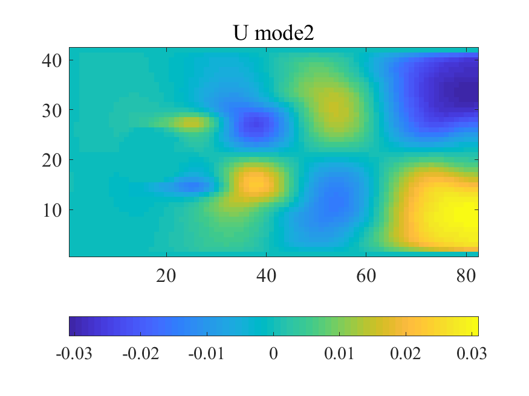
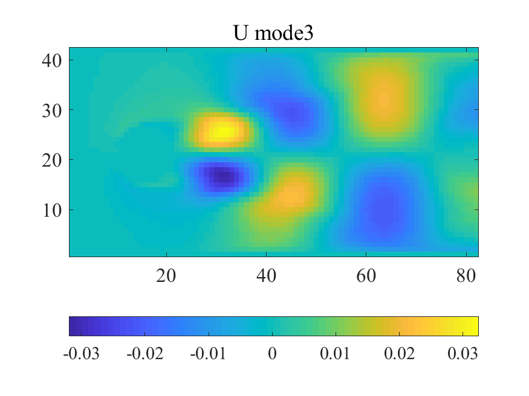
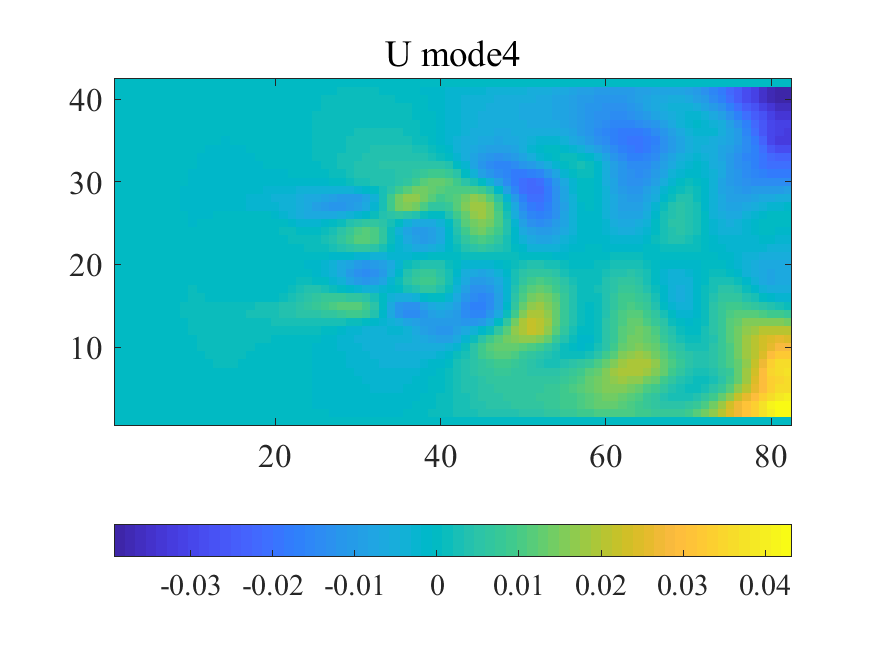
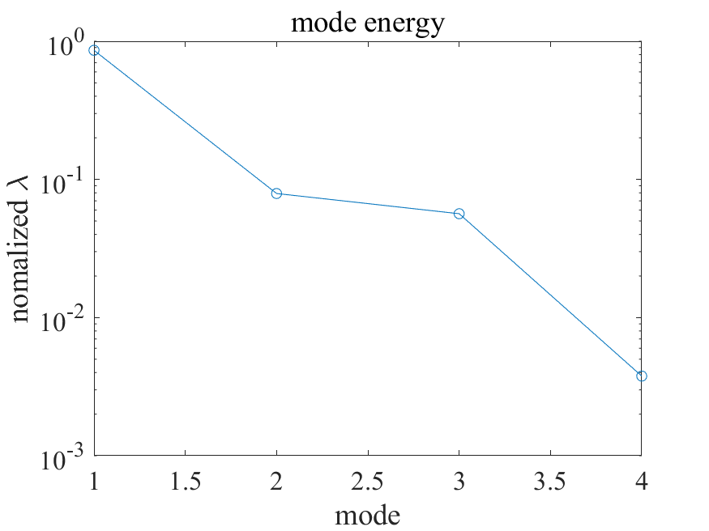

## POD (Proper Orthogonal Decomposition) analysis-in-2D-flow

## demo
・U mode1 
   
・U mode2 
  
・U mode3 
  
・U mode4 
 
・mode energy 
 

## Reference
平 邦彦 (2011) 『固有直交分解による流体解析1. 基礎』，ながれ30 115－123．

## Author
T.Nakabayashi
